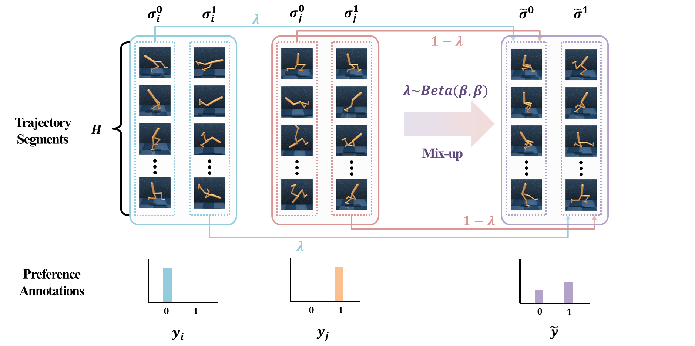

# MCP
Official Implementation of [MCP (Mixing Corrupted Preferences)](https://openreview.net/forum?id=kCcIYc98ho) (ICLR 2024 Submission version). 
<p align="center"></p>

## Human Evaluation Results
### DMControl Walker : PEBBLE(Left) and MCP(Right)
<p align="center">
  
  
</p>

```bash
for seed in 12345 23451 34512 45123 51234 67890 78906 89067 90678 6789; do
# PEBBLE
python train_PEBBLE_human.py env=walker_walk seed=$seed agent.params.actor_lr=0.0005 agent.params.critic_lr=0.0005 num_train_steps=500000 agent.params.batch_size=1024 double_q_critic.params.hidden_dim=1024 double_q_critic.params.hidden_depth=2 diag_gaussian_actor.params.hidden_dim=1024 diag_gaussian_actor.params.hidden_depth=2 \
    num_unsup_steps=9000 reward_batch=10 num_interact=20000 max_feedback=100 feed_type=1 reward_update=50 reset_update=100 \
    teacher_beta=-1 teacher_gamma=1 teacher_eps_skip=0 teacher_eps_mistake=0 teacher_eps_equal=0

# MCP
python train_PEBBLE_mixup_human.py env=walker_walk seed=$seed agent.params.actor_lr=0.0005 agent.params.critic_lr=0.0005 num_train_steps=500000 agent.params.batch_size=1024 double_q_critic.params.hidden_dim=1024 double_q_critic.params.hidden_depth=2 diag_gaussian_actor.params.hidden_dim=1024 diag_gaussian_actor.params.hidden_depth=2 \
    num_unsup_steps=9000 reward_batch=10 num_interact=20000 max_feedback=100 feed_type=1 reward_update=50 reset_update=100 \
    teacher_beta=-1 teacher_gamma=1 teacher_eps_skip=0 teacher_eps_mistake=0 teacher_eps_equal=0
done
```

## How to Install

### Docker Setting and Install Mujoco 2.1.0

```bash
# run docker container
docker run -it -d --shm-size=32g --gpus=all -v /your/drive/location:/mnt/hdd/workspace --name MCP pytorch/pytorch:1.11.0-cuda11.3-cudnn8-runtime
apt-get update
apt-get install sudo
sudo apt update
cd ../mnt/hdd/workspace

# install mujoco
wget https://mujoco.org/download/mujoco210-linux-x86_64.tar.gz
mkdir /root/.mujoco
tar -xvzf mujoco210-linux-x86_64.tar.gz -C /root/.mujoco
sudo apt install libglew-dev libgl-dev

# for human label display online
apt-get install -y qt5-default libxcb-xinerama0-dev
pip install PyQt5==5.14.2

# copy and paste following commands into /root/.bashrc
export LD_LIBRARY_PATH=/root/.mujoco/mujoco210/bin
export LD_LIBRARY_PATH=$LD_LIBRARY_PATH:/usr/lib/nvidia
export PATH="$LD_LIBRARY_PATH:$PATH"
export LD_PRELOAD=/usr/lib/x86_64-linux-gnu/libGL.so:/usr/lib/x86_64-linux-gnu/libGLEW.so

cd root
source .bashrc

sudo apt-get install python3-dev build-essential libssl-dev libffi-dev libxml2-dev
sudo apt install libosmesa6-dev libgl1-mesa-glx libglfw3 patchelf libegl1 libopengl0

sudo apt-get install libxslt1-dev zlib1g-dev python3-pip

conda install git
git clone https://github.com/openai/mujoco-py
cd mujoco-py
pip install -r requirements.txt
pip install -r requirements.dev.txt

pip3 install -e . --no-cache
```

### Install Dependencies
Python 3.8.12

```bash
pip install mujoco==2.3.5
pip install gym==0.25.2
pip install dm_control==1.0.12
pip install git+https://github.com/denisyarats/dmc2gym.git
pip install tensorboard termcolor pybullet scikit-image
pip install hydra-core==1.0.4
pip install "cython<3"
```

## Note
### Metaworld Dependency
```bash
wget https://github.com/Farama-Foundation/Metaworld/archive/refs/tags/v2.0.0.tar.gz
tar -xvzf v2.0.0.tar.gz
cd Metaworld-2.0.0
pip install metaworld -e .
```

### Hydra Dependency
We used hydra with current version of 1.0.4, while original [B-Pref](https://github.com/rll-research/BPref) used version 0.x.
We slightly modified hydra configuration in **config** folder and *hydra.main()* args in all **train_x.py**. It does not affect the experiment, but only affect compatibility for hydra version.
For more details, please refer to [hydra config path changes](https://hydra.cc/docs/upgrades/0.11_to_1.0/config_path_changes/)

## How to run

### DMControl(Walker)
#### PEBBLE
```bash
python train_PEBBLE.py env=walker_walk agent.params.actor_lr=0.0005 agent.params.critic_lr=0.0005 num_train_steps=1000000 agent.params.batch_size=1024 double_q_critic.params.hidden_dim=1024 double_q_critic.params.hidden_depth=2 diag_gaussian_actor.params.hidden_dim=1024 diag_gaussian_actor.params.hidden_depth=2 num_unsup_steps=9000 reward_batch=10 num_interact=20000 max_feedback=100 feed_type=1 reward_update=50 reset_update=100 teacher_beta=-1 teacher_gamma=1 teacher_eps_skip=0 teacher_eps_mistake=0 teacher_eps_equal=0
```

#### MCP
```bash
python train_PEBBLE_mixup.py env=walker_walk agent.params.actor_lr=0.0005 agent.params.critic_lr=0.0005 num_train_steps=1000000 agent.params.batch_size=1024 double_q_critic.params.hidden_dim=1024 double_q_critic.params.hidden_depth=2 diag_gaussian_actor.params.hidden_dim=1024 diag_gaussian_actor.params.hidden_depth=2 num_unsup_steps=9000 reward_batch=10 num_interact=20000 max_feedback=100 feed_type=1 reward_update=50 reset_update=100 teacher_beta=-1 teacher_gamma=1 teacher_eps_skip=0 teacher_eps_mistake=0 teacher_eps_equal=0
```

#### SURF
```bash
python train_PEBBLE_semi.py env=walker_walk agent.params.actor_lr=0.0005 agent.params.critic_lr=0.0005 num_train_steps=1000000 agent.params.batch_size=1024 double_q_critic.params.hidden_dim=1024 double_q_critic.params.hidden_depth=2 diag_gaussian_actor.params.hidden_dim=1024 diag_gaussian_actor.params.hidden_depth=2 num_unsup_steps=9000 reward_batch=10 num_interact=20000 max_feedback=100 feed_type=1 reward_update=50 reset_update=100 threshold_u=0.99 teacher_beta=-1 teacher_gamma=1 teacher_eps_skip=0 teacher_eps_mistake=0 teacher_eps_equal=0
```

#### SURF + MCP
```bash
python train_PEBBLE_semi_mixup.py env=walker_walk agent.params.actor_lr=0.0005 agent.params.critic_lr=0.0005 num_train_steps=1000000 agent.params.batch_size=1024 double_q_critic.params.hidden_dim=1024 double_q_critic.params.hidden_depth=2 diag_gaussian_actor.params.hidden_dim=1024 diag_gaussian_actor.params.hidden_depth=2 num_unsup_steps=9000 reward_batch=10 num_interact=20000 max_feedback=100 feed_type=1 reward_update=50 reset_update=100 threshold_u=0.99 teacher_beta=-1 teacher_gamma=1 teacher_eps_skip=0 teacher_eps_mistake=0 teacher_eps_equal=0
```

### Metaworld(Sweep Into)
#### PEBBLE
```bash
python train_PEBBLE.py env=metaworld_sweep-into-v2 agent.params.actor_lr=0.0003 agent.params.critic_lr=0.0003  num_train_steps=1000000 agent.params.batch_size=512 double_q_critic.params.hidden_dim=256 double_q_critic.params.hidden_depth=3 diag_gaussian_actor.params.hidden_dim=256 diag_gaussian_actor.params.hidden_depth=3 num_unsup_steps=9000 reward_batch=50 num_interact=5000 max_feedback=10000 feed_type=1 reward_update=10 reset_update=100 segment=25 teacher_beta=-1 teacher_gamma=1 teacher_eps_skip=0 teacher_eps_mistake=0 teacher_eps_equal=0
```

#### MCP
```bash
python train_PEBBLE_mixup.py env=metaworld_sweep-into-v2 agent.params.actor_lr=0.0003 agent.params.critic_lr=0.0003  num_train_steps=1000000 agent.params.batch_size=512 double_q_critic.params.hidden_dim=256 double_q_critic.params.hidden_depth=3 diag_gaussian_actor.params.hidden_dim=256 diag_gaussian_actor.params.hidden_depth=3 num_unsup_steps=9000 reward_batch=50 num_interact=5000 max_feedback=10000 feed_type=1 reward_update=10 reset_update=100 segment=25 mixup_alpha=0.5 teacher_beta=-1 teacher_gamma=1 teacher_eps_skip=0 teacher_eps_mistake=0 teacher_eps_equal=0
```

#### SURF
```bash
python train_PEBBLE_semi.py env=metaworld_sweep-into-v2 agent.params.actor_lr=0.0003 agent.params.critic_lr=0.0003  num_train_steps=1000000 agent.params.batch_size=512 double_q_critic.params.hidden_dim=256 double_q_critic.params.hidden_depth=3 diag_gaussian_actor.params.hidden_dim=256 diag_gaussian_actor.params.hidden_depth=3 num_unsup_steps=9000 reward_batch=50 num_interact=5000 max_feedback=10000 feed_type=1 reward_update=10 reset_update=100 segment=25 threshold_u=0.999 teacher_beta=-1 teacher_gamma=1 teacher_eps_skip=0 teacher_eps_mistake=0 teacher_eps_equal=0
```

#### SURF + MCP
```bash
python train_PEBBLE_semi_mixup.py env=metaworld_sweep-into-v2 agent.params.actor_lr=0.0003 agent.params.critic_lr=0.0003  num_train_steps=1000000 agent.params.batch_size=512 double_q_critic.params.hidden_dim=256 double_q_critic.params.hidden_depth=3 diag_gaussian_actor.params.hidden_dim=256 diag_gaussian_actor.params.hidden_depth=3 num_unsup_steps=9000 reward_batch=50 num_interact=5000 max_feedback=10000 feed_type=1 reward_update=10 reset_update=100 segment=25 mixup_alpha=0.5 threshold_u=0.999 teacher_beta=-1 teacher_gamma=1 teacher_eps_skip=0 teacher_eps_mistake=0 teacher_eps_equal=0
```

## Acknowledgement
Our implementation benefits from the official codebase of [B-Pref](https://github.com/rll-research/BPref), [SURF](https://github.com/alinlab/SURF), [RUNE](https://github.com/rll-research/rune), and [MRN](https://github.com/RyanLiu112/MRN). We appreciate their insightful works.

## Citation
```latex
@misc{
heo2024mixing,
title={Mixing Corrupted Preferences for Robust and Feedback-Efficient Preference-Based Reinforcement Learning},
author={Jongkook Heo and Young Jae Lee and Jaehoon Kim and Min Gu Kwak and Youngjoon Park and Seoung Bum Kim},
year={2024},
url={https://openreview.net/forum?id=kCcIYc98ho}
}
```
